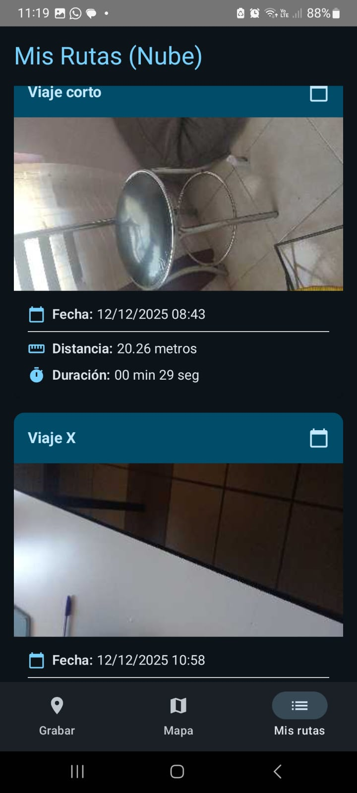
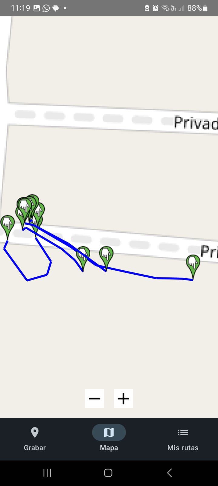

# [TripCam]

> **Proyecto Integrador - Desarrollo de Aplicaciones Móviles**
>
> **Semestre:** [4° E]
> **Fecha de entrega:** 11 de Diciembre

---

## Equipo de Desarrollo

| Nombre Completo | Rol / Tareas Principales | Usuario GitHub |
| :--- | :--- | :--- |
| [Angelica Tapia Pérez] | [Ej. UI Design, Repositorio] | @Angelica0918 |
| [Monserrat Torres Morales] | [Ej. Backend, Retrofit] | @Monserrattorress |
| [Fernando Rodolfo Martinez Martinez] | [Ej. Sensores, Lógica] | @Fernando-825 |

---

## Descripción del Proyecto

**¿Qué hace la aplicación?**
El proyecto es una aplicación que guarda las rutas de los viajes realizados la cual permite comenzar un viaje, y trazar la ruta del mismo, cuando llegas al destino puedes tomar una foto y se guarda tu viaje
Haciendo uso de Retrofit para un servidor local permitiendo las funcionalidades de un CRUD y usando el sensor GPS para borrar algún viaje guardado

**Objetivo:**
Demostrar la implementación de una arquitectura robusta en Android utilizando servicios web y hardware del dispositivo.

---

## Stack Tecnológico y Características

Este proyecto ha sido desarrollado siguiendo estrictamente los lineamientos de la materia:

* **Lenguaje:** Kotlin 100%.
* **Interfaz de Usuario:** Jetpack Compose.
* **Arquitectura:** MVVM (Model-View-ViewModel).
* **Conectividad (API REST):** Retrofit.
    * **GET:** Obtiene la lista de los viajes realizados y los puntos de ubicación registrados
    * **POST:** Envía el punto de inicio y final para crear el viaje
    * **UPDATE:** Actualiza el nombre de viaje ya guardado
    * **DELETE:** Elimina un viaje antes registrado
* **Sensor Integrado:** GPS
    * *Uso:* Traza las rutas de los viajes realizados

---

## Capturas de Pantalla

[Coloca al menos 3 (investiga como agregarlas y se vean en GitHub)]

| Pantalla de Inicio | Operación CRUD | Uso del Sensor |
| :---: | :---: | :---: |
|  |  |  |

---

## Instalación y Releases

El ejecutable firmado (.apk) se encuentra disponible en la sección de **Releases** de este repositorio.

[Liga correctamente tu link de releases en la siguiente sección]

1.  Ve a la sección "Releases" (o haz clic [aquí](link_a_tus_releases)).
2.  Descarga el archivo `.apk` de la última versión.
3.  Instálalo en tu dispositivo Android (asegúrate de permitir la instalación de orígenes desconocidos).
